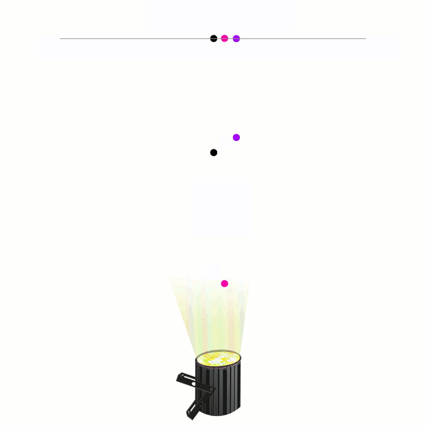
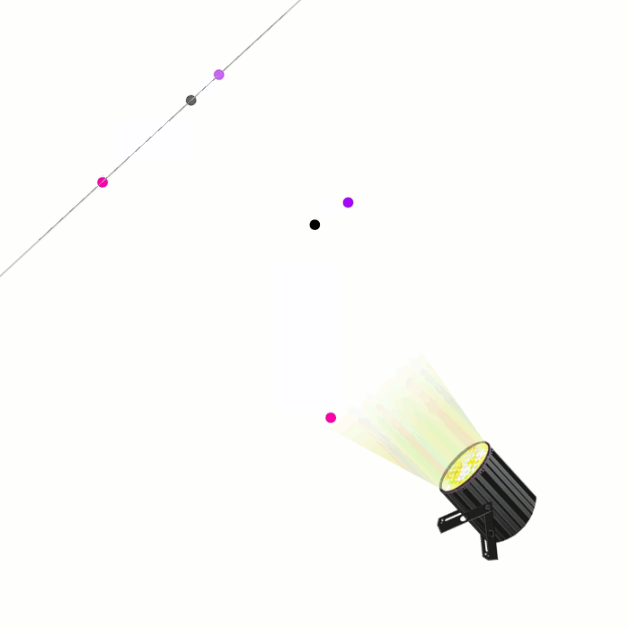
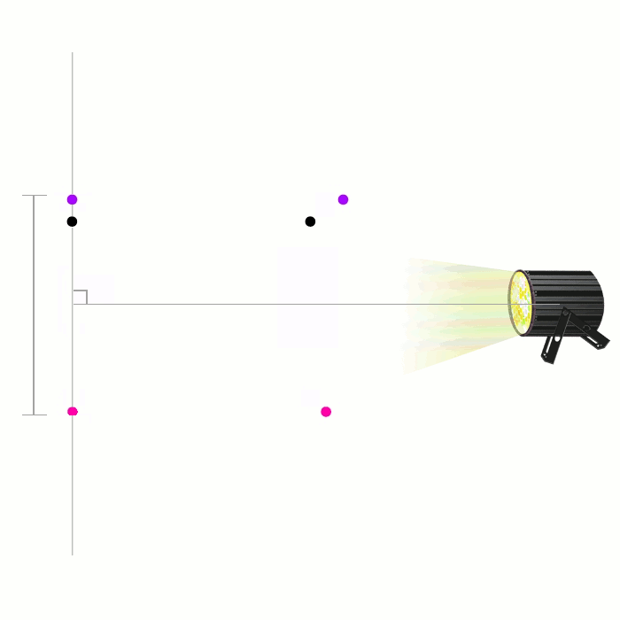
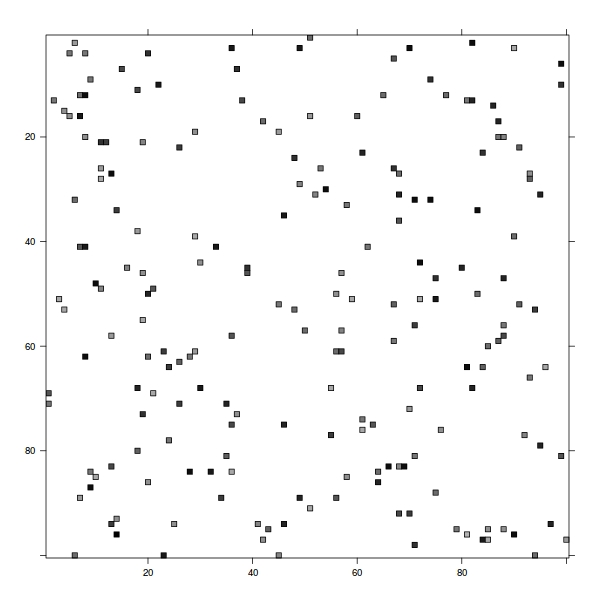
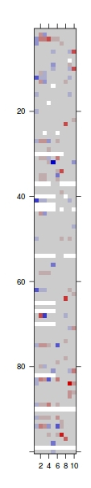
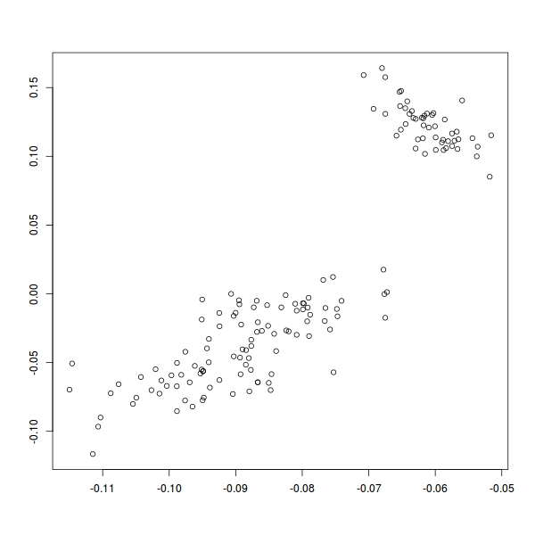
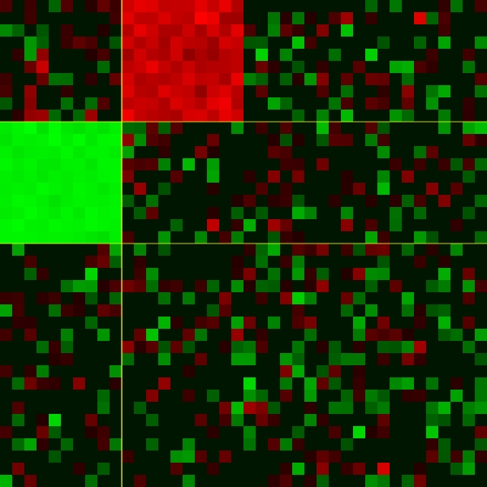
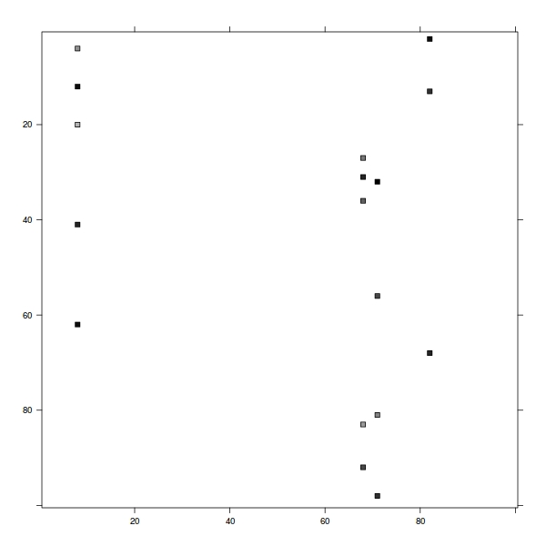

---
output:
  revealjs::revealjs_presentation:
    transition: fade
    mathjax: "//cdn.mathjax.org/mathjax/latest/MathJax.js?config=TeX-AMS-MML_HTMLorMML"
    fig_width: 9
    fig_height: 7
    css: style.css
---

##

<br/><br/><br/>

<font style="font-size: 96px; font-weight: 800; color: black;">Project and Conquer!</font>

<br/><br/>
Bryan W Lewis
<br/>
rstor.io
<br/>
http://illposed.net


##  {data-background="kid.jpg"}

<!--
##  {data-background="third_man.jpg"}
-->

##  {data-background="nosferatu.png"}

##  {data-background="ipod.gif"}

##  {data-background="kid.jpg"}

##

<br/><br/><br/>

<font style="font-size: 96px; color: black;">Point of view matters</font>

##


##


##

<br/><br/><br/>

<font style="font-size: 96px; color: black;">Shadows of Data</font>


##


##
<div style="position: absolute; top: -20px; left: 120px;">
The purple and pink dots are _at least_ this far apart.
</div>


##


##
<div style="position: absolute; left: -100px; width: 250px; top: 240px;">
The purple and pink dots are _at least_ this far apart.
</div>
<div style="position: absolute; top: 0px; left: 150px;">

</div>


##

<br/><br/><br/>
The *tcor* algorithm: fast thresholded distances and correlations.

<br/>
https://github.com/bwlewis/tcor


## Example

<br/><br/>
1,000 &times; 20,522 matrix, find all pairs of columns with Pearson's correlation coefficient ≥ 0.99.

- brute force needs > 200 GFlops
- tcor solves exactly the same problem using about 1 GFlop _(in seconds on a laptop)_
- easily extends to distributed and arbitrarily large data


## Recall, point of view matters

<br/><br/>
What subspaces to project into?
<br/><br/>
What kinds of projections?

## I prefer Krylov subspaces

<br/><br/>
$$ \mathrm{span}(\beta, X\beta, X^2\beta, \ldots, X^{k-1}\beta), $$

<br/>
$$ \mathrm{span}(\beta, X^TX\beta, (X^TX)^2\beta, \ldots, (X^TX)^{k-1}\beta), \qquad \ldots $$

<br/><br/>
**Random** &beta; for data exploration,
<br/>
**measured** &beta; for supervised models


## What other applications?




##

...focus on the information content (PCA, SVD, etc.)...


&nbsp;&nbsp;&nbsp;&nbsp;


<br/>
(https://cran.r-project.org/package=irlba)


##

...or perhaps cluster similar features...



<br/>
(also https://cran.r-project.org/package=irlba)


##

...or maybe bi-cluster similar rows and columns...



<br/>
https://CRAN.R-project.org/package=s4vd (Kaiser & Sill)

##

Sparse biclust algorithm by Lee, Shen, Huang, and Marron

<br/><br/>
1,000 $\times$ 10,000 example matrix timed on a cheap laptop

```{r eval=FALSE, background="#ffffff"}
library(s4vd)
set.seed(1)
x = matrix(rnorm(1000 * 10000), nrow=1000)
i = seq(from=1, to=nrow(x), by=2)
j = seq(from=1, to=ncol(x), by=2)
x[i,j] = rnorm(length(i)*length(j), mean=2, sd=0.5)
cl = biclust(x, method=BCssvd, K=1)
```

```
- Original routines      3,522s

- Reformulated routines     20s
```

##

...maybe the data represent a network...

```{r, eval=TRUE, echo=FALSE}
suppressPackageStartupMessages(library(threejs, quietly=TRUE))
data(LeMis)
graphjs(LeMis, vertex.size = 1, vertex.label="")
```

##

...we might desire the most central vertices,

```{r, eval=TRUE, echo=FALSE}
M = as_adjacency_matrix(LeMis)
v = Matrix::colSums(M)
v = v / max(v)    # normalize
graphjs(LeMis, vertex.size = 3 * v, vertex.label="")
```

##

or perhaps the most communicable paths, etc....
```{r, eval=TRUE, echo=FALSE}
library(Matrix)
M = as_adjacency_matrix(LeMis)
E = expm(M)
E = E * M / max(E)
c = rep("gray", 254)
c[E[as_edgelist(LeMis)] > 0.4] = "red"
graphjs(LeMis, vertex.size=0.1, edge.width=2, edge.color=c)
```


## Kleinberg hub-authority centrality

https://github.com/bwlewis/rfinance-2017/topm.r

Compare to Pad&eacute; approximant for 1000 &times; 1000 directed-network adjacency matrix
```{r eval=FALSE}
system.time(ex <- diag(expm(X) + expm(-X)) / 2)
# user    system elapsed
# 151.080 0.220  151.552

head(order(ex, decreasing=TRUE), 5)
#[1] 11 25 27 29 74
```

```{r eval=FALSE}
system.time(top <- topm(X, type="centrality"))
# user  system elapsed
# 0.555 0.010  0.565

top$hubs
#[1] 11 25 27 29 74
```


## Matrix completion

<br/><br/>

Cool algorithm by Cai, Cand&egrave;s, Shen,
prototype: https://github.com/bwlewis/rfinance-2017/svt.r

<br/>
Input matrix M with missing values except in index set P.

##

<br/><br/>
Input matrix M with missing values every except index set P.
<br/><br/>
<br/>
$$ \min\,\,\mathrm{rank}(X) \,\,\mathrm{s. t.}\,\, X_P = M_P $$

##
<br/><br/>
Input matrix M with missing values every except index set P.
<br/><br/>
<br/>
$$ \min\,\,\mathrm{rank}(X) \,\,\mathrm{s. t.}\,\, X_P = M_P $$

<br/>
$$ \min\,\,||X||_* \,\,\mathrm{s. t.}\,\, X_P = M_P $$


##

<br/>

...or, maybe we want to select interesting features (columns)...
<br/>




##

<br/><br/>
Generalized Krylov subspaces  (Voss, Lanza, Morigi, Reichel, Sgallari, ...) to solve

<br/><br/>

$$ \min \frac{1}{p}||X\beta - y||^p_p + \frac{\mu}{q}||\Phi(\beta)||^q_q $$

<br/>

q = 1 (Lasso) _and_ q < 1 (closer to subset selection!)

##  {data-background="kid.jpg"}

## Projection methods turn big data into data

<br/> <br/>
https://bwlewis.github.io/rfinance-2017

<br/>
https://github.com/bwlewis/rfinance-2017

<br/><br/>
Thanks, Diethelm!
